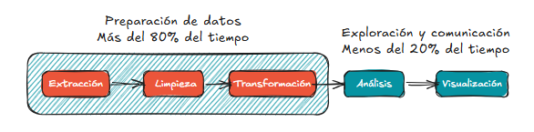

01. Introducción al análisis de datos en Python
1. Tipos de datos en ciencia de datos
2. Python para análisis de datos
2.1. Lenguaje de integración
2.2. Problema de los dos lenguajes
2.2. Limitaciones
Esta materia se centra en los aspectos prácticos de manipular, procesar, limpiar y transformar datos utilizando Python. Su objetivo es proporcionar una guía sólida de las herramientas y bibliotecas del ecosistema orientado a datos, capacitando al lector para convertirse en un analista efectivo. Aunque el término habla de «análisis de datos», el enfoque específico recae en la programación con Python y sus bibliotecas, más que en metodologías estadísticas avanzadas. Se trata, en esencia, de la programación que necesitas para trabajar con datos.

El término «ciencia de datos» se popularizó como denominador común para técnicas que van desde estadística descriptiva hasta aprendizaje automático. El ecosistema de Python para análisis de datos ha crecido exponencialmente en los últimos años, con numerosos recursos especializados en áreas avanzadas. Esta materia sirve como fundamento (espero que sólido) para abordar posteriormente dominios más específicos con confianza.

Es habitual referirse al contenido como «manipulación de datos» (data wrangling o munging), en lugar de análisis propiamente dicho, ya que gran parte del esfuerzo recae en preparar y estructurar los datos antes de cualquier modelado o inferencia.

Ejemplo introductorio: flujo típico de manipulación de datos con pandas
import pandas as pd

Cargar datos -> limpiar valores faltantes -> filtrar -> transformar
df = pd.read_csv('datos.csv') # Carga de datos
df_clean = (df                # Limpieza y transformación
    .dropna()                 # Eliminar filas con valores faltantes
    .query('ventas > 0')      # Filtrar ventas positivas
    .assign(ventas_log=lambda x: np.log(x['ventas'])) # Crear nueva columna con logaritmo de ventas
)

Diagrama de flujo típico en manipulación de datos: carga → limpieza → filtrado → transformación.

1. Tipos de datos en ciencia de datos
El término «datos» en este contexto se refiere principalmente a datos estructurados, una categoría amplia que incluye:

Datos tabulares: columnas heterogéneas (texto, números, fechas) como los de hojas de cálculo o bases de datos relacionales. Ejemplos: registros de clientes, ventas, encuestas.
Arrays multidimensionales: matrices numéricas homogéneas (por ejemplo, imágenes o series temporales).
Tablas relacionadas: conjuntos interconectados mediante claves (similares a claves primarias/foráneas en SQL). Ejemplo: una tabla de clientes y otra de ventas vinculadas por un ID de cliente.
Series temporales: observaciones indexadas por tiempo, con intervalos regulares o irregulares. Ejemplo: precios diarios de acciones.
Aunque no exhaustiva, esta clasificación cubre la mayoría de los conjuntos de datos encontrados en la práctica. Incluso datos no estructurados (como textos o imágenes) pueden transformarse en formatos estructurados mediante extracción de características (por ejemplo, convertir artículos de prensa en una matriz de frecuencia de palabras para análisis de sentimiento).

# Ejemplo: estructuras de datos comunes en pandas
import pandas as pd
import numpy as np

# Tabular: es una tabla con filas (registros) y columnas (variables)
df_tabular = pd.DataFrame({'fecha': pd.date_range('2025-01-01', periods=3),
                           'valor': [10.5, 11.2, 9.8]})
                           
# Podríasmos verla como la siguiente tabla:                        
# | fecha       | valor |
# |-------------|-------|
# | 2025-01-01  | 10.5  |
# | 2025-01-02  | 11.2  |
# | 2025-01-03  | 9.8   |

# Series temporal
serie_temporal = pd.Series([100, 102, 105], 
                           index=pd.date_range('2025-01-01', periods=3))

# En este caso, es equivalente a la siguiente "tabla" (en realidad es un diccionario con fechas como claves y valores numéricos):
#   2025-01-01    100
#   2025-01-02    102
#   2025-01-03    105
# dtype: int64
# Pero en pandas una Serie es un array unidimensional con un índice (fechas en este caso), mientras que un DataFrame es una tabla bidimensional con filas y columnas.
         

# Array multidimensional (con NumPy)
array_3d = np.random.rand(4, 5, 6)
# Esto representa un array de 4 bloques, cada bloque con 5 filas y 6 columnas (por ejemplo, podría ser un conjunto de 4 imágenes de 5x6 píxeles con valores de intensidad entre 0 y 1).

# Tablas relacionadas (simulando una relación entre clientes y ventas)
clientes = pd.DataFrame({'cliente_id': [1, 2, 3], 'nombre': ['Alice', 'Bob', 'Charlie']})
ventas = pd.DataFrame({'venta_id': [101, 102, 103], 'cliente_id': [1, 2, 1], 'monto': [250, 150, 300]})
Tipos de datos comunes en análisis de datos: tablas, series temporales, arrays multidimensionales y tablas relacionadas.

2. Python para análisis de datos
Python, creado en 1991, se ha consolidado como uno de los lenguajes interpretados más populares, destacando especialmente desde mediados de la década de 2000 gracias a frameworks web como Django. Aunque a menudo se le denomina «lenguaje de scripting» (de eso ya hemos hablado en la materia de Estructuras de Control en Python), esta etiqueta subestima su capacidad para desarrollar software robusto y escalable.

Histórica y culturalmente, Python ha cultivado una comunidad excepcionalmente activa en computación científica y análisis de datos. En las últimas dos décadas ha evolucionado desde una herramienta de nicho hasta convertirse en el lenguaje principal en ciencia de datos, aprendizaje automático e ingeniería de software, tanto en ámbitos académicos como en la industria.

Frente a alternativas como R, MATLAB, SAS o Stata, las bibliotecas de código abierto de Python (pandas, scikit-learn, statsmodels) lo han situado como opción preferente para análisis de datos.

Su ventaja competitiva radica en combinar herramientas analíticas de alto nivel con la solidez de un lenguaje generalista, ideal para construir aplicaciones completas de datos.

2.1. Lenguaje de integración
Parte del éxito de Python en ciencia computacional se debe a su capacidad para integrar fácilmente código en C, C++ y FORTRAN. La mayoría de las bibliotecas científicas heredadas (para álgebra lineal, optimización, FFT, etc.) están escritas en estos lenguajes de bajo nivel. Python actúa como «pegamento» que permite acceder a dichas rutinas optimizadas sin sacrificar la productividad del desarrollo.

En aplicaciones reales, solo una pequeña fracción del código consume la mayor parte del tiempo de ejecución. Python permite escribir el 90% del sistema de forma rápida y legible, reservando la optimización en lenguajes de bajo nivel únicamente para los cuellos de botella críticos.

# Ejemplo: integración transparente con código optimizado (NumPy)
import numpy as np
import time

# Versión puramente en Python (lenta)
start = time.time()
total = sum([i**2 for i in range(10_000_000)])
print(f"Puro Python: {time.time() - start:.2f}s")

# Versión con NumPy (usa código C/FORTRAN optimizado)
start = time.time()
total = np.sum(np.arange(10_000_000)**2)
print(f"Con NumPy: {time.time() - start:.2f}s")
La salida del código anterior muestra una diferencia de rendimiento significativa, con la versión de NumPy ejecutándose en una fracción del tiempo que tarda el código puro en Python, gracias a su implementación en C/FORTRAN optimizado:

Puro Python: 0.72s
Con NumPy: 0.03s
Python como lenguaje de integración: el código Python actúa como una capa que une bibliotecas optimizadas en C, C++ y FORTRAN, permitiendo un desarrollo rápido sin sacrificar el rendimiento.

2.2. Problema de los dos lenguajes
Tradicionalmente, muchas organizaciones utilizaban un lenguaje especializado (R, SAS) para investigación y prototipado, y otro distinto (Java, C#) para sistemas de producción. Esta dualidad genera fricción entre equipos y retrasos en la puesta en producción de modelos analíticos.

Python es una solución unificadora: es igualmente adecuado para exploración interactiva (gracias a Jupyter/IPython) y para desarrollo de sistemas robustos en producción. Al compartir un único entorno de herramientas, investigadores e ingenieros colaboran con mayor fluidez, reduciendo costos y acelerando la innovación. Alternativas como Julia, que se puede ejecutar en Notebooks (es la Ju de Jupyter), también abordan este problema, pero Python ofrece la ventaja adicional de un ecosistema maduro y versátil para aplicaciones más allá del análisis de datos.

2.2. Limitaciones
A pesar de sus ventajas, Python presenta dos limitaciones importantes:

Rendimiento interpretado: el código puro en Python suele ser más lento que el compilado (C++, Java). Aunque esto rara vez es crítico (el tiempo de desarrollo suele ser más valioso que el de CPU), en sistemas de ultra-baja latencia (como high-frequency trading) puede justificarse el uso de lenguajes de menor nivel.

Global Interpreter Lock (GIL): este mecanismo impide la ejecución simultánea de múltiples hilos de Python puro, limitando el paralelismo para tareas intensivas en CPU. No obstante:

Operaciones en bibliotecas como NumPy liberan el GIL y ejecutan en paralelo.
Herramientas como multiprocessing evitan el GIL mediante procesos separados.
Compiladores JIT como Numba permiten alcanzar rendimiento cercano a C sin abandonar Python.
# Ejemplo: sorteo del GIL mediante procesos (multiprocessing)
from multiprocessing import Pool
import numpy as np

def procesar_chunk(chunk):
    return np.sqrt(chunk).sum()  # Operación que libera el GIL en NumPy

datos = np.random.rand(10_000_000)
chunks = np.array_split(datos, 4)

with Pool(4) as p:
    resultado = sum(p.map(procesar_chunk, chunks))
El GIL limita la ejecución simultánea de hilos en Python puro, pero las operaciones en bibliotecas como NumPy liberan el GIL, permitiendo paralelismo. Además, herramientas como multiprocessing y compiladores JIT como Numba ofrecen alternativas para sortear esta limitación.

“Python ofrece un equilibrio entre productividad, versatilidad y rendimiento para el trabajo con datos. Su ecosistema abierto, su capacidad de integración y su adopción como lenguaje unificador entre investigación y producción lo convierten en una elección estratégica para quienes buscan dominar el análisis de datos moderno. Esta materia proporciona las bases técnicas necesarias para aprovechar plenamente este potencial.”
